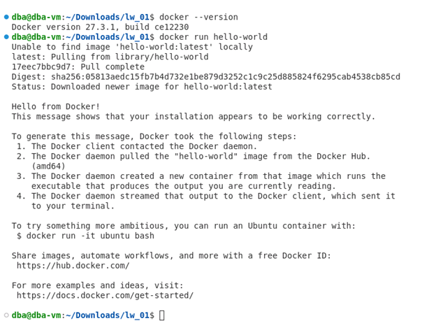
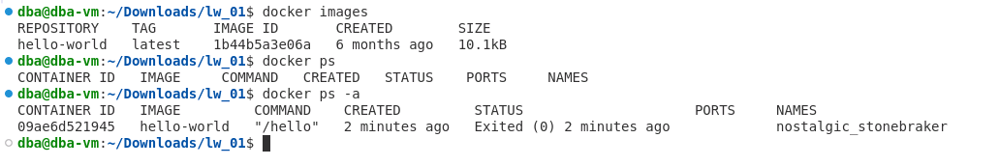
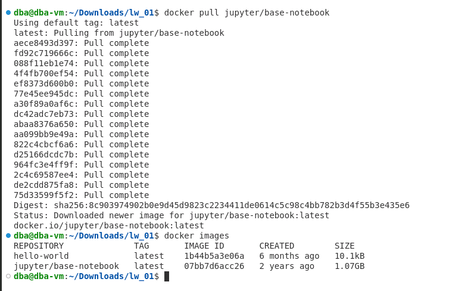
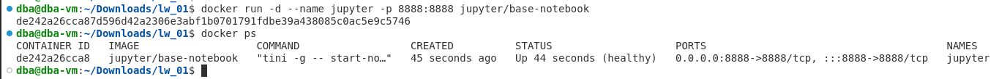
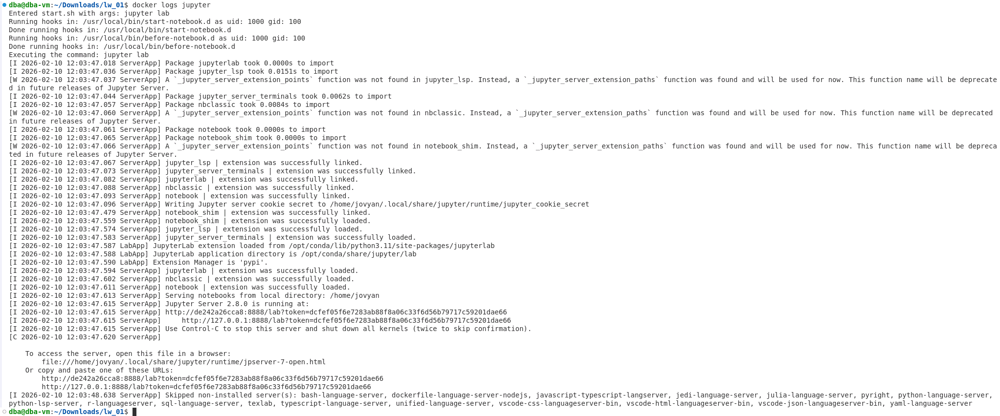
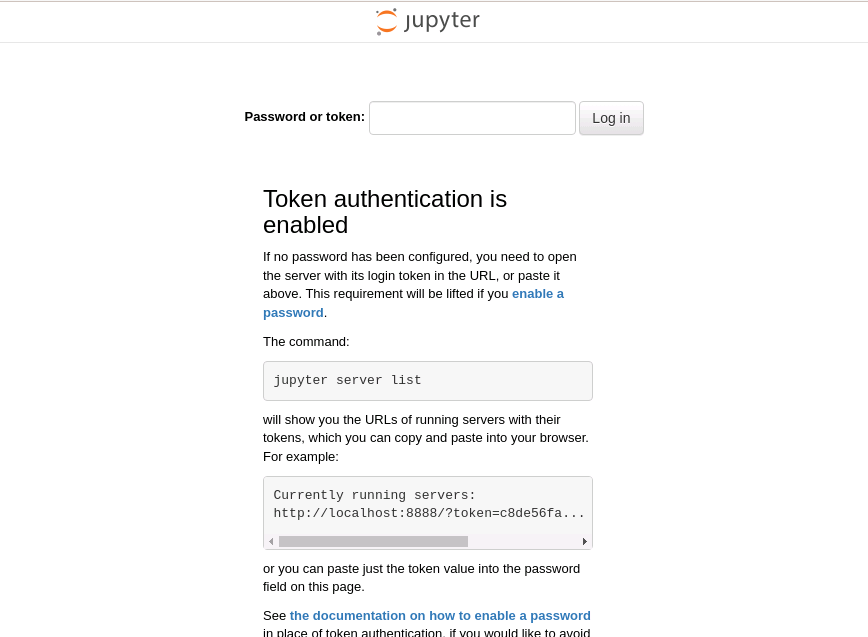
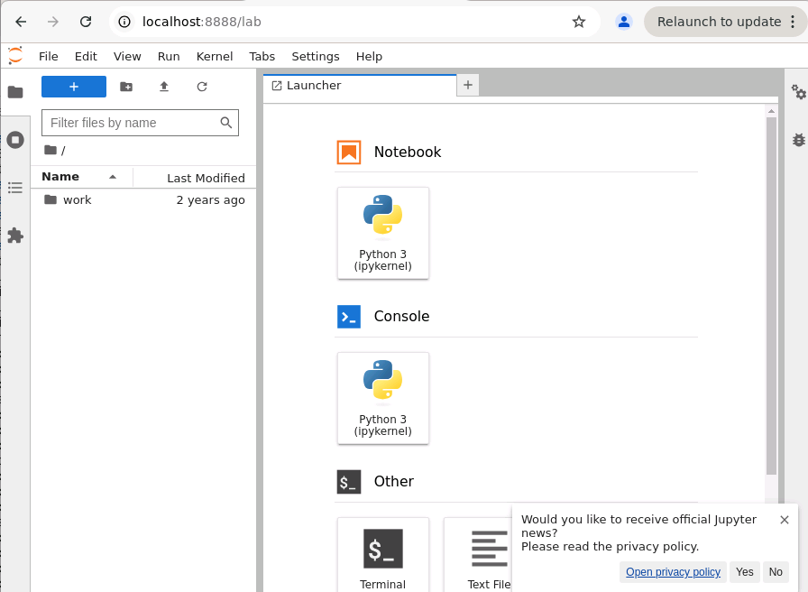
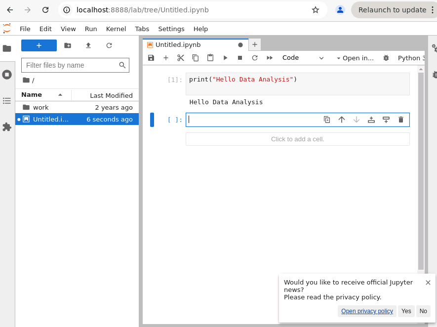
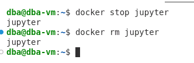

# Лабораторная работа №1  
## Установка и настройка Docker. Работа с контейнерами в Docker

**ФИО:** Джамалова Сабина Шахиновна  
**Группа:** АДЭУ-221
**Вариант:** 6 — Jupyter Notebook  
---

## Цель работы
Освоить процесс установки и настройки Docker, изучить основные команды Docker CLI, получить практический опыт работы с контейнерами и образами, а также понять принципы контейнеризации для развертывания аналитических сред.

---

## Ход выполнения работы

### Подготовка среды
Виртуальная машина `dev_kub_student.ova` была импортирована в VirtualBox и успешно запущена. Все дальнейшие действия выполнялись в терминале виртуальной машины.

### Установка Docker
Выполнено обновление пакетов и установка Docker

### Проверка установки
```bash
docker --version
docker run hello-world
```

### Знакомство с командами Docker CLI
```bash
docker images
docker ps
docker ps -a
```


## Индивидуальное задание (Вариант 6 — Jupyter Notebook)
### Скачивание образа и проверка
```bash
docker pull jupyter/base-notebook
docker images
```


### Запуск контейнера с перебросом порта и проверка запуска
```bash
docker run -d --name jupyter -p 8888:8888 jupyter/base-notebook
docker ps
```


### Получение токена
```bash
docker logs jupyter
```

### Проверка работы

Открыт браузер по адресу:
```bash
http://localhost:8888
```


Введен токен для доступа 

Создан новый Python Notebook и выполнена тестовая команда:
```bash
print("Hello Data Analysis")
```


### Остановка контейнера
```bash
docker stop jupyter
docker rm jupyter
```

## Выводы

В ходе выполнения лабораторной работы был изучен процесс установки и настройки Docker в среде Linux. Получены практические навыки использования основных CLI-команд для работы с контейнерами и образами. Освоен запуск контейнеризированного сервиса на примере среды Jupyter Notebook с пробросом портов и доступом через браузер.
Контейнеризация показала удобство быстрого развертывания готовых аналитических сред без ручной установки зависимостей.

Возможные трудности: получение токена доступа и настройка сетевого доступа к контейнеру. Все проблемы были успешно решены.
