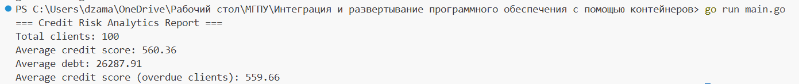
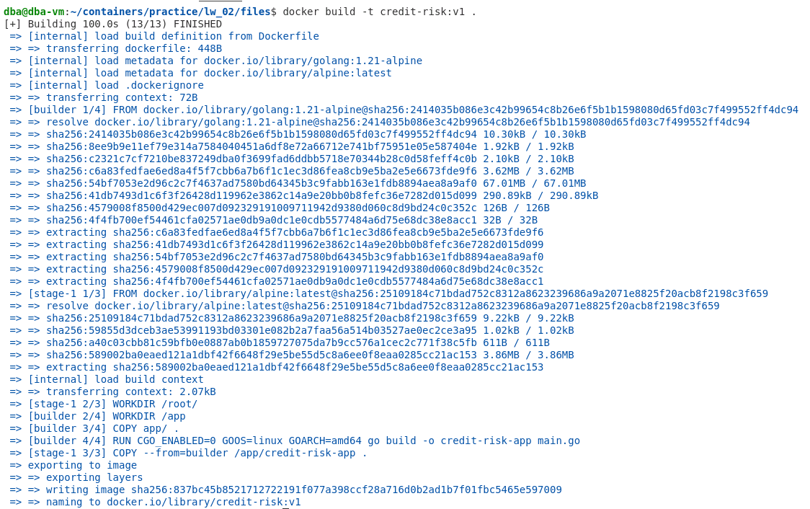
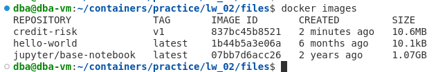
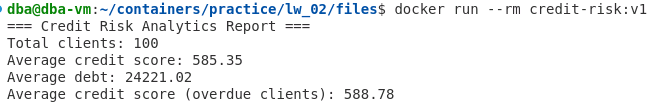
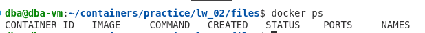

# Лабораторная работа №2 
## Создание Dockerfile и сборка образа

**ФИО:** Джамалова Сабина Шахиновна  
**Группа:** АДЭУ-221
**Вариант:** 6 
---
## Цель работы
Научиться разрабатывать воспроизводимые аналитические инструменты. Пройти полный цикл: от написания Python-скрипта для обработки бизнес-данных до его упаковки в Docker-образ и запуска в изолированной среде.

## 1. Описание предметной области

В данной работе рассматривается предметная область **кредитного риска (Credit Risk)**.

Кредитный риск — это вероятность того, что заемщик не выполнит свои финансовые обязательства перед банком (например, допустит просрочку платежа).

Анализ таких данных позволяет:
- оценивать качество кредитного портфеля,
- выявлять проблемных клиентов,
- принимать решения о выдаче кредитов.

## 2. Используемые данные

В рамках работы используются синтетически сгенерированные данные о клиентах.

Каждая строка CSV-файла содержит информацию об одном клиенте.

## Структура данных

| Поле | Описание |
|------|----------|
| client_id | Уникальный идентификатор клиента |
| credit_score | Кредитный рейтинг клиента (от 300 до 850) |
| income | Годовой доход клиента |
| debt | Общая сумма долга |
| overdue | Наличие просрочки (0 — нет, 1 — есть) |

Данные генерируются внутри программы с использованием случайных значений.

---

## 3. Рассчитываемая бизнес-метрика

В работе рассчитываются следующие показатели:

### 1. Средний кредитный рейтинг (Average Credit Score)

Показывает средний уровень кредитоспособности клиентов.

### 2. Средний долг (Average Debt)

Показывает среднюю долговую нагрузку клиентов.

### 3. Средний кредитный рейтинг клиентов с просрочкой

Дополнительно рассчитывается средний кредитный рейтинг среди клиентов,
у которых имеется просрочка (overdue = 1).

## Ход выполнения работы
### 1. Разработка аналитического скрипта

- Создана консольная программа на Go.
- Реализована генерация синтетических данных Credit Risk.
- Данные сохраняются в CSV-файл.
- Реализован парсинг CSV.
- Рассчитаны:
  - средний кредитный рейтинг,
  - средний долг,
  - средний рейтинг клиентов с просрочкой.
- Проверена работа программы в терминале без Docker.

---

### 2. Создание Dockerfile

- Использован multi-stage build.
- Первый этап — сборка бинарного файла в образе golang.
- Второй этап — запуск в минимальном образе alpine.
- Добавлен .dockerignore для исключения лишних файлов.

---

### 3. Сборка Docker-образа

- Выполнена команда сборки образа:
  docker build -t credit-risk:v1 .
- Сборка прошла без ошибок.

---

### 4. Проверка созданного образа

- Проверено наличие образа в системе:
  docker images

---

### 5. Запуск контейнера

- Выполнен запуск:
  docker run --rm credit-risk:v1
- Контейнер корректно вывел результаты аналитики.
- После завершения контейнер автоматически удаляется (--rm).

---

### 6. Проверка удаления контейнера

## Выводы
# 6. Вывод

В ходе работы была разработана консольная программа на Go для анализа кредитного риска, которая генерирует синтетические данные и рассчитывает ключевые метрики. Программа была упакована в Docker-контейнер с использованием multi-stage build, что позволило создать лёгкий и переносимый образ. Контейнер корректно запускается, выводит аналитический отчёт в консоль и автоматически удаляется после завершения работы.  
Работа демонстрирует навыки работы с Go, Docker и базовой аналитикой данных.
