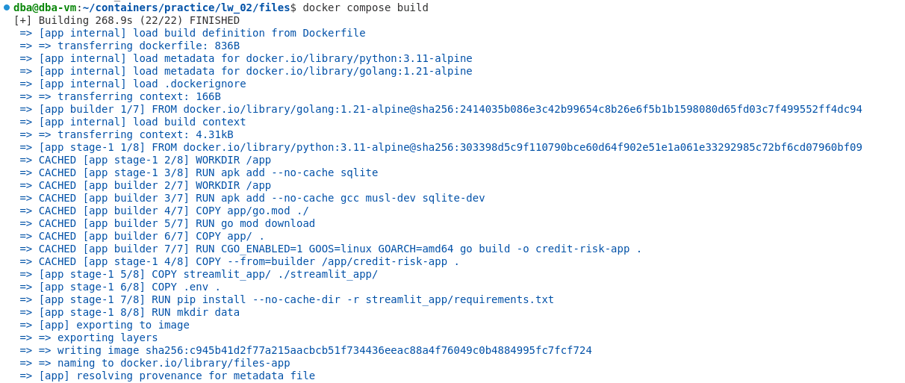
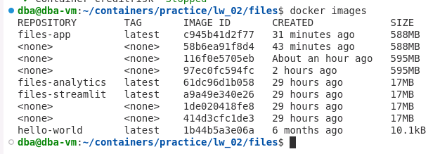
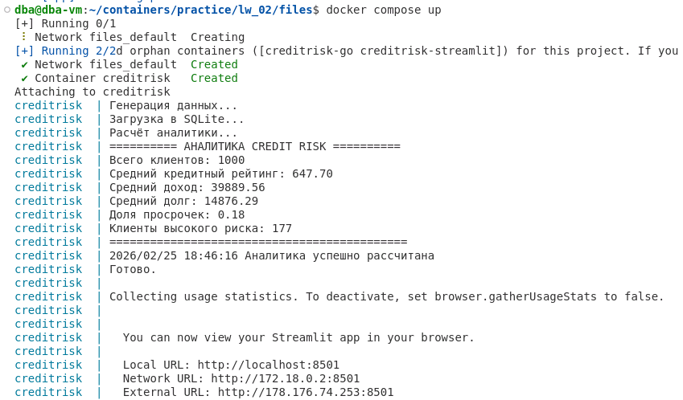

# Лабораторная работа №2 
## Создание Dockerfile и сборка образа

**ФИО:** Джамалова Сабина Шахиновна  
**Группа:** АДЭУ-221
**Вариант:** 6 
---
## Цель работы
Научиться разрабатывать воспроизводимые аналитические инструменты. Пройти полный цикл: от написания Python-скрипта для обработки бизнес-данных до его упаковки в Docker-образ и запуска в изолированной среде.

## 1. Описание предметной области

В данной работе рассматривается предметная область **кредитного риска (Credit Risk)**.

Кредитный риск — это вероятность того, что заемщик не выполнит свои финансовые обязательства перед банком (например, допустит просрочку платежа).

Анализ таких данных позволяет:
- оценивать качество кредитного портфеля,
- выявлять проблемных клиентов,
- принимать решения о выдаче кредитов.

## 2. Используемые данные

В рамках работы используются синтетически сгенерированные данные о клиентах.

Каждая строка CSV-файла содержит информацию об одном клиенте.

## Структура данных
| Поле | Описание |
|------|----------|
| id | Уникальный идентификатор клиента |
| age | Возраст клиента (в годах) |
| credit_score | Кредитный рейтинг клиента (от 300 до 850) |
| income | Годовой доход клиента |
| debt | Общая сумма задолженности клиента |
| delinquent |Флаг просрочки (1 — дефолт, 0 — нет) |

Данные генерируются внутри программы с использованием случайных значений (с учетом бизнес-задачи).

---

## 3. Рассчитываемая бизнес-метрика

В работе рассчитываются следующие показатели:

### 1. Средний кредитный рейтинг (Average Credit Score)

Показывает средний уровень кредитоспособности клиентов.

### 2. Средний долг (Average Debt)

Показывает среднюю долговую нагрузку клиентов.

### 3. Средний кредитный рейтинг клиентов с просрочкой

Дополнительно рассчитывается средний кредитный рейтинг среди клиентов,
у которых имеется просрочка (overdue = 1).

## Ход выполнения работы
### 1. Структура проекта
!Структура проекта](img/img01.png)

### 2. Сборка Docker-образа

### 3. Проверка созданного образа
- Проверено наличие образа в системе:
  docker images
  

### 4. Запуск
  docker compose up
  

### 5. Визуализация через Streamlit

## Выводы
В ходе работы была разработана консольная программа на Go для анализа кредитного риска, которая генерирует синтетические данные и рассчитывает ключевые метрики. Программа была упакована в Docker-контейнер с использованием multi-stage build, что позволило создать лёгкий и переносимый образ. Контейнер корректно запускается, выводит аналитический отчёт в консоль и автоматически удаляется после завершения работы.  
Работа демонстрирует навыки работы с Go, Docker и базовой аналитикой данных.
