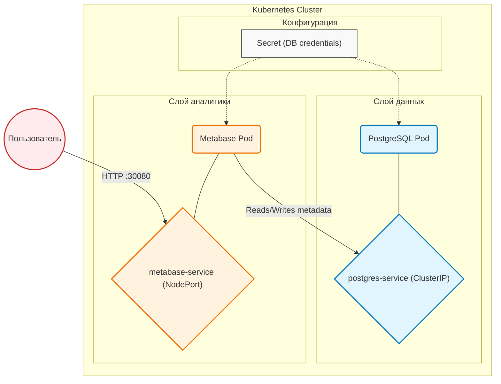
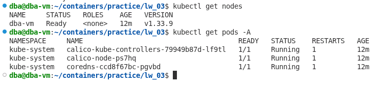
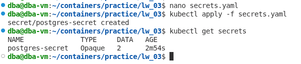
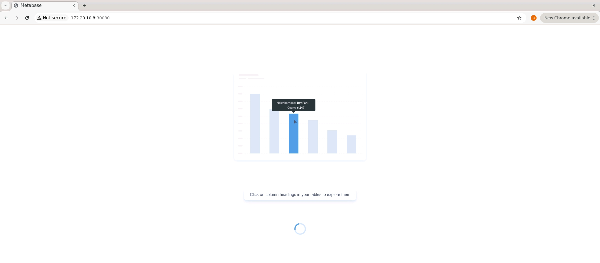
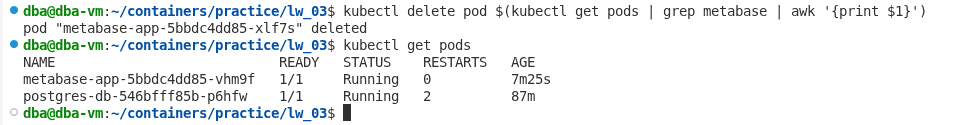
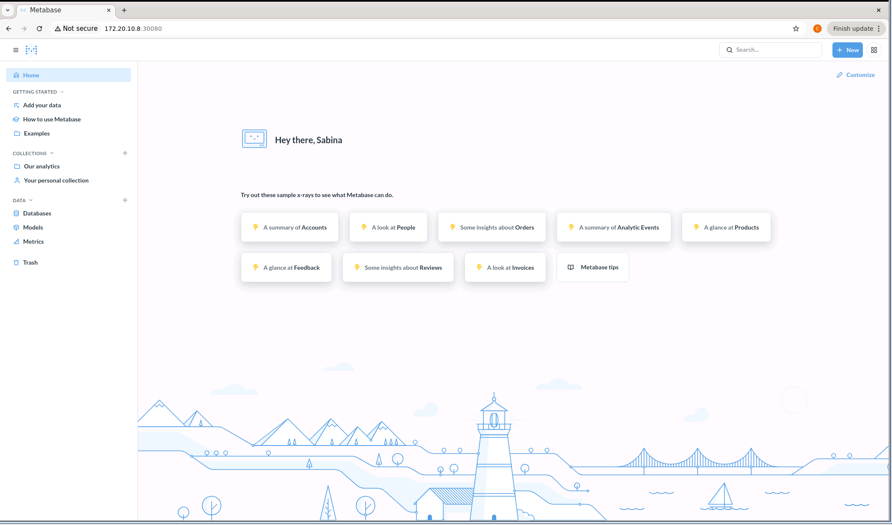
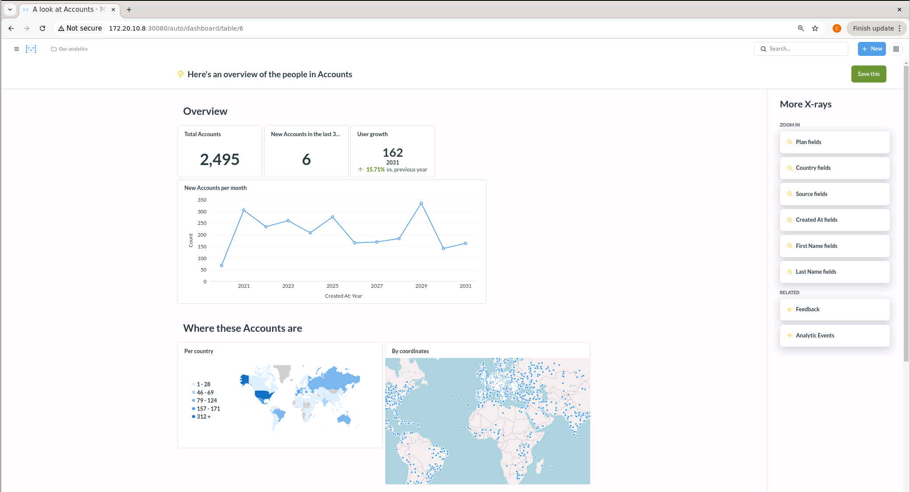
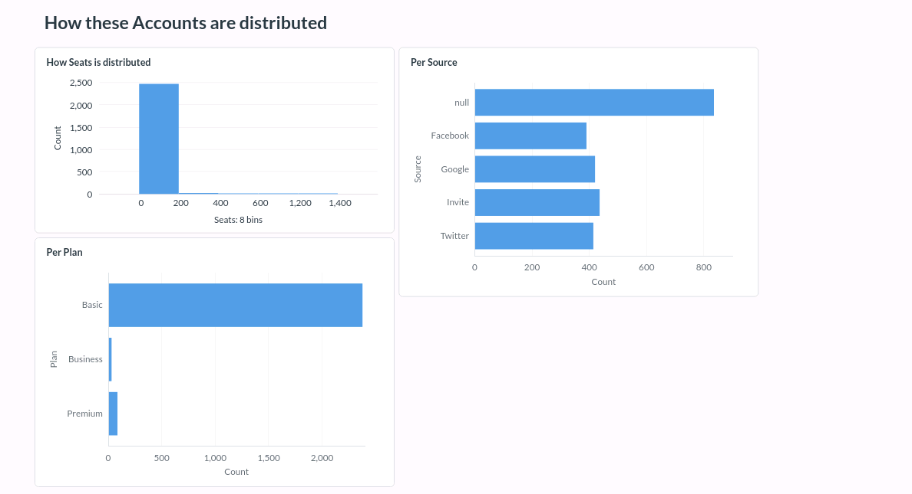

# Лабораторная работа 3.1

## Развертывание приложения в Kubernetes

**ФИО:** Джамалова Сабина Шахиновна
**Группа:** АДЭУ-221
**Вариант:** 6
**Тема:** Развертывание Metabase и PostgreSQL в Kubernetes

---

## Цель работы

Освоить процесс оркестрации контейнеров с использованием Kubernetes.
Научиться разворачивать связку сервисов (аналитическое приложение и база данных), управлять их взаимодействием и обеспечивать сетевую доступность.

---

## Ход выполнения
### Архитектура решения


### 1. Подготовка окружения

Проверено состояние Kubernetes-кластера:

```
kubectl get nodes
kubectl get pods -A
```


---

### 2. Создание Secret

Для безопасного хранения учетных данных PostgreSQL был создан объект Secret:

```yaml
apiVersion: v1
kind: Secret
metadata:
  name: postgres-secret
type: Opaque
data:
  POSTGRES_USER: bWV0YWJhc2VfdXNlcg==
  POSTGRES_PASSWORD: bWV0YWJhc2VfcGFzcw==
```

Secret используется для передачи логина и пароля в контейнеры.

---

### 3. Развертывание PostgreSQL

Создан Deployment для базы данных:

```yaml
apiVersion: apps/v1
kind: Deployment
metadata:
  name: postgres-db
spec:
  replicas: 1
  selector:
    matchLabels:
      app: postgres
  template:
    metadata:
      labels:
        app: postgres
    spec:
      containers:
        - name: postgres
          image: postgres:15
          ports:
            - containerPort: 5432
          env:
            - name: POSTGRES_DB
              value: metabase_db
            - name: POSTGRES_USER
              valueFrom:
                secretKeyRef:
                  name: postgres-secret
                  key: POSTGRES_USER
            - name: POSTGRES_PASSWORD
              valueFrom:
                secretKeyRef:
                  name: postgres-secret
                  key: POSTGRES_PASSWORD
```

---

### 4. Создание Service для PostgreSQL

```yaml
apiVersion: v1
kind: Service
metadata:
  name: postgres-service
spec:
  selector:
    app: postgres
  ports:
    - port: 5432
      targetPort: 5432
  type: ClusterIP
```

Service обеспечивает доступ к базе данных внутри кластера по имени `postgres-service`.

---

### 5. Развертывание Metabase

Создан Deployment для аналитического приложения:

```yaml
apiVersion: apps/v1
kind: Deployment
metadata:
  name: metabase-app
spec:
  replicas: 1
  selector:
    matchLabels:
      app: metabase
  template:
    metadata:
      labels:
        app: metabase
    spec:
      containers:
        - name: metabase
          image: metabase/metabase:latest
          ports:
            - containerPort: 3000
          env:
            - name: MB_DB_TYPE
              value: postgres
            - name: MB_DB_DBNAME
              value: metabase_db
            - name: MB_DB_PORT
              value: "5432"
            - name: MB_DB_HOST
              value: postgres-service
            - name: MB_DB_USER
              valueFrom:
                secretKeyRef:
                  name: postgres-secret
                  key: POSTGRES_USER
            - name: MB_DB_PASS
              valueFrom:
                secretKeyRef:
                  name: postgres-secret
                  key: POSTGRES_PASSWORD
```

Подключение к PostgreSQL осуществляется через Service `postgres-service`.

---

### 6. Создание Service для Metabase

```yaml
apiVersion: v1
kind: Service
metadata:
  name: metabase-service
spec:
  selector:
    app: metabase
  type: NodePort
  ports:
    - port: 80
      targetPort: 3000
      nodePort: 30080
```

Данный сервис обеспечивает доступ к Metabase из браузера.

---

### 7. Проверка работоспособности

Проверка состояния Pod:

```
kubectl get pods
```

Проверка сервисов:

```
kubectl get services
```

Все Pod находятся в статусе `Running`.

---
Работа веб-интерфейса



### 8. Проверка подключения Metabase к PostgreSQL

Для проверки был выполнен перезапуск Pod Metabase:

```
kubectl delete pod <metabase-pod>
```


После перезапуска настройки Metabase сохранились, что подтверждает использование PostgreSQL как хранилища метаданных.



---

### 9. Демонстрация аналитики

В Metabase был использован тестовый набор данных (Sample Dataset).
На его основе построен дашборд с визуализацией данных (график/диаграмма).




---

##  Результаты

* Развернуты PostgreSQL и Metabase в Kubernetes
* Настроено взаимодействие между сервисами
* Реализовано безопасное хранение данных через Secret
* Обеспечен доступ к приложению через NodePort
* Подтверждена работоспособность системы

---

##  Вывод

В ходе лабораторной работы была развернута связка аналитического приложения Metabase и базы данных PostgreSQL в Kubernetes.

Kubernetes позволяет эффективно управлять контейнерами, обеспечивать их взаимодействие и масштабируемость.
Использование Service упрощает сетевую коммуникацию, а Deployment обеспечивает автоматическое восстановление сервисов.

Применение Secret повышает безопасность хранения конфиденциальных данных.
