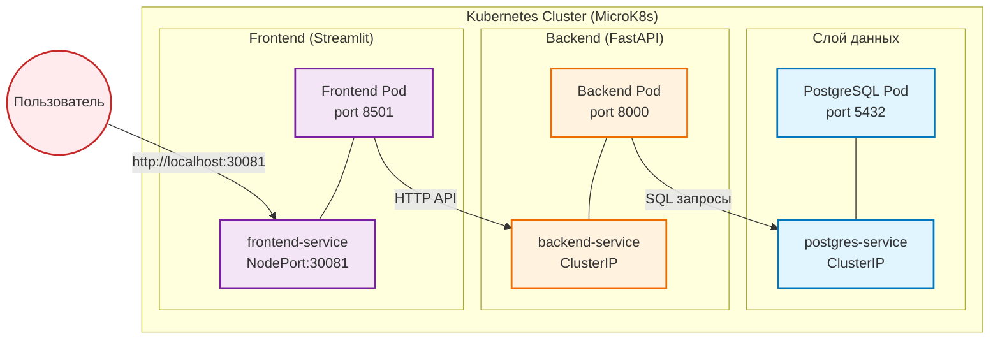
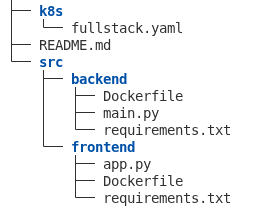
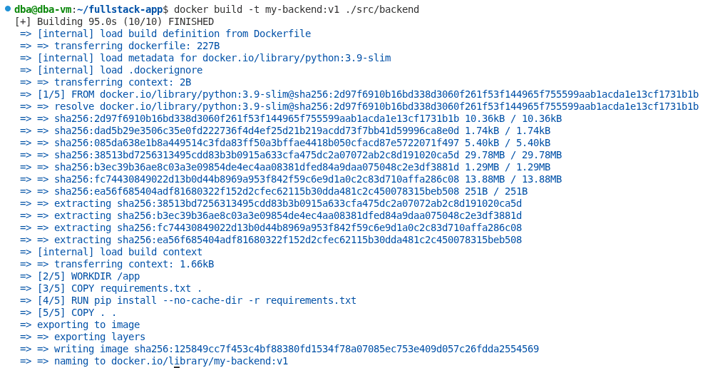
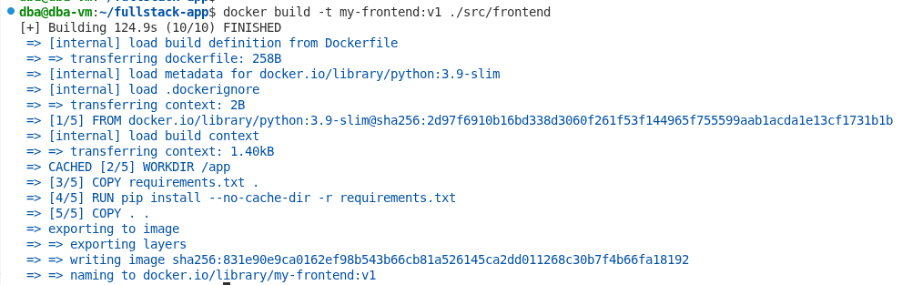
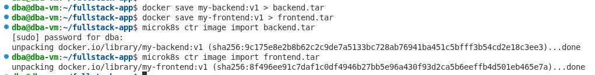
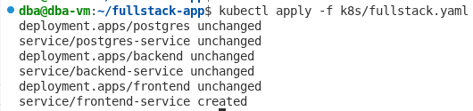
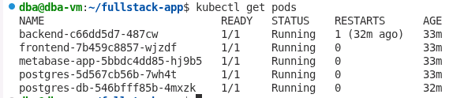
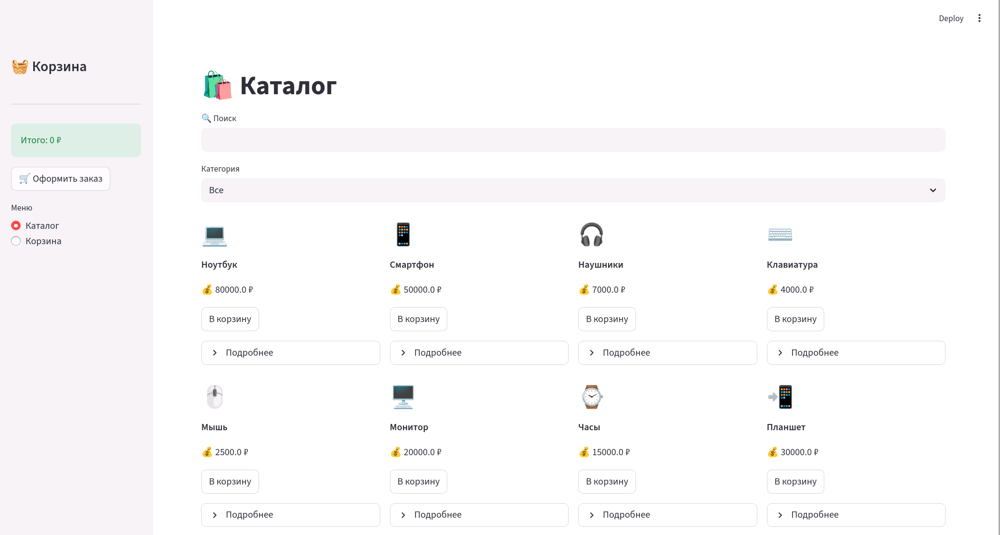
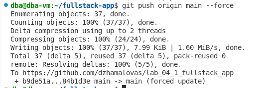

# Лабораторная работа 4.1

## 4.1. Создание и развертывание полнофункционального приложения

**ФИО:** Джамалова Сабина Шахиновна 
**Группа:** АДЭУ-221  
**Вариант:** 6

| Название системы | Бизнес-задача | Данные (Пример) |
|------|----------|----------|
| Product Catalog | Каталог товаров интернет-магазина | Название, цена, количество на складе, категория |

---

## 1. Цель работы

Целью работы является разработка и развертывание трехзвенного приложения (Frontend + Backend + Database) в Kubernetes, а также организация взаимодействия между сервисами.

---

## 2. Используемые технологии

* Python
* FastAPI (backend)
* Streamlit (frontend)
* PostgreSQL (база данных)
* Docker
* Kubernetes
* GitHub  (CI/CD)

---

## 3. Архитектура приложения

---
### Дерево проекта 

## 4. Реализация [backend](https://github.com/dzhamalovas/lab_04_1_fullstack_app/tree/main/src/backend)

Backend реализован с использованием FastAPI.
Обеспечивает API для работы с товарами и корзиной.

Функционал:

* получение списка товаров
* добавление товара в корзину
* удаление товара из корзины
* оформление заказа
* обновление остатков товаров

---

## 5. Реализация [frontend](https://github.com/dzhamalovas/lab_04_1_fullstack_app/tree/main/src/frontend)

Frontend реализован на Streamlit.

Функционал:

* отображение каталога товаров
* поиск и фильтрация
* добавление товаров в корзину
* отображение корзины в боковой панели
* отдельная страница корзины

---

## 6. Контейнеризация приложения

Для backend и frontend были созданы Docker-образы.

### Сборка backend

### Сборка frontend

---

## 7. Импорт образов в Kubernetes

Docker-образы были импортированы в MicroK8s:

---

## 8. Развертывание в Kubernetes

---

## 9. Проверка работы кластера

Проверка состояния подов:

Все сервисы находятся в состоянии Running.

---

## 10. Работа приложения

Интерфейс приложения:

Реализован каталог товаров с возможностью добавления в корзину.

---

## 11. Работа с Git

Проект загружен в репозиторий:

---

## 12. CI/CD

В проекте настроены пайплайны CI/CD:

### GitHub Actions:

* проверка зависимостей backend
* проверка зависимостей frontend
* проверка Kubernetes YAML

### Github CI:

* сборка Docker-образов
* запуск контейнеров
* очистка окружения

---
Ссылка на репозиторий проекта: https://github.com/dzhamalovas/lab_04_1_fullstack_app

## 13. Вывод

В ходе выполнения лабораторной работы было разработано и успешно развернуто полнофункциональное трехзвенное приложение в кластере Kubernetes, представляющее собой каталог товаров интернет-магазина с пользовательским интерфейсом. 
В рамках реализации был создан backend на FastAPI, обеспечивающий работу с базой данных PostgreSQL и реализующий бизнес-логику управления товарами и корзиной, включая изменение остатков при оформлении заказа. Frontend на Streamlit предоставляет удобный интерфейс с возможностью просмотра каталога, поиска и фильтрации товаров, а также работы с корзиной. Все компоненты приложения были контейнеризованы с использованием Docker и развернуты в Kubernetes с настройкой взаимодействия через сервисы. 
Дополнительно был настроен базовый CI/CD пайплайн. В результате была получена работоспособная система, демонстрирующая практическое применение микросервисной архитектуры, контейнеризации и оркестрации приложений.

